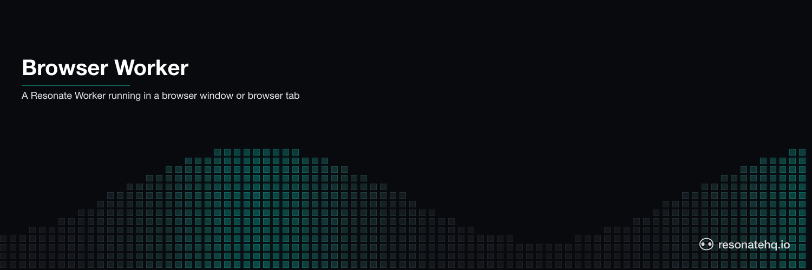

<p align="center">
  <picture>
    <source media="(prefers-color-scheme: dark)" srcset="./assets/banner-dark.png">
    <source media="(prefers-color-scheme: light)" srcset="./assets/banner-light.png">
    
  </picture>
</p>

# Resonate Workers in the Browser

** Currently only works in chrome **

A fun demo showing how Resonate Workers can be hosted in the browser using the [Resonate TypeScript SDK](https://github.com/resonatehq/resonate-sdk-ts).

## What it does

This demo implements a recursive factorial function that:
- Executes in the browser as a Resonate worker
- Can be triggered by creating promises via the Resonate CLI

## Running the Example

### 1. Start Resonate Server

Install the [Resonate Server](https://github.com/resonatehq/resonate):

```bash
brew install resonatehq/tap/resonate
```

Start the Resonate Server without persistence and with CORS enabled:

```bash
resonate serve --storage-sqlite-path :memory: --server-cors-allow-origin "*"
```

### 2. Start the Resonate Wroker(s)

```bash
npm run dev
```

### 2. Run Factorial

Create a durable promise representing the durable invocation of factorial(5)

```bash
resonate invoke factorial.5 --func factorial --arg 5  --target poll://any@default
```

Fetch the result

```bash
resonate promises get factorial.5
```

You should see:
- Recursive calls displayed in the browser: `factorial(5) called`, `factorial(4) called`, etc.
- Final result: 120 (5! = 5×4×3×2×1)

## Scripts

- `npm run build` - Build the browser bundle
- `npm run dev` - Build and serve with auto-refresh
- `npm run serve` - Serve the built files

## Architecture

- **Frontend**: Browser worker polling for tasks via Server-Sent Events
- **Backend**: Resonate server managing distributed state and task routing
- **Communication**: HTTP API for task claiming, SSE for real-time updates
